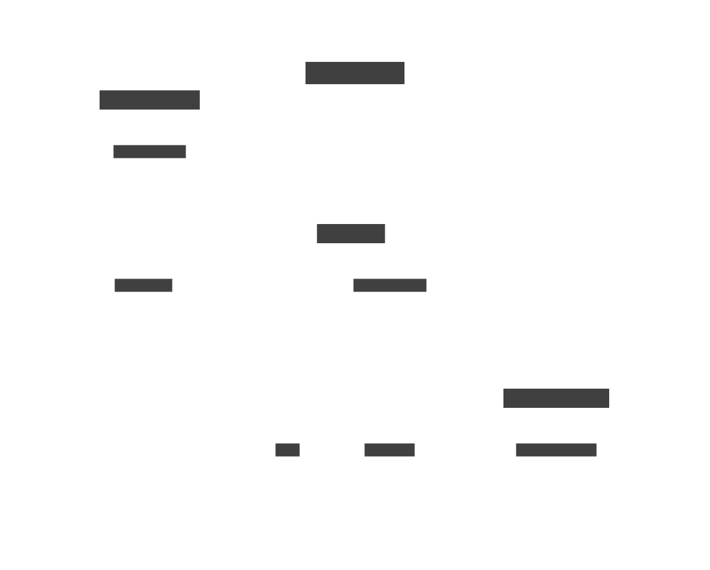

AppNavigator est le fichier permetant de définir la navigation du projet. TabNavigator est le container global de l'application, c'est ici que nous définissons les screens apparaissant dans le footer de l'application.
Par défaut, l'application se place sur la carte.

Les composants du footer sont des piles de Screens. Une pile permet de naviguer plus facilement entre des Screens ayant une dépendance. 

##Piles

Chaque pile a un Screen par défaut qui est celui qui sera appelé lorsque que l'on appuie sur les boutons du footer.

Nous avons donc 3 piles 
* ExcursionStack
* CarteStack
* ParametresStack

La pile excrusion permet de pouvoir naviguer facilement entre le screen des excursion et celui des filtres et de pouvoir transmettre les valeurs de filtres facilement.

La pile carte regroupe tous les screens ayant besoin de la carte ou bien détaillant un excursion. 

La pile carte permet de naviguer facilement sur des pages contenant des informations ou bien des permetant de changer un paramètre. Pour l'instant aucun autre screen n'est dans cette pile mais à l'avenir il a vocation a avoir plusieurs screen de paramétrage ou d'informations.

##Passage de variables entre pages

Afin de pouvoir passer des variables entre les différentes pages de l'application, nous définissons les variables que chaque pile a besoin.
Par exemple, dans la pile `CarteStack`, nous definissons les différents Screens de cette pile, avec pour chaque screen les variables qu'il reçoit lors de la navigation.

```
type CarteStackParamList = {
  Carte: undefined;
  DetailsExcursion: undefined | { excursion: T_excursion };
  Description: { excursion: T_excursion };
  NouveauSignalement: { type: T_TypeSignalement };
};
```

Pour naviguer d'une application à l'autre, nous utilisons navigate que nous recevons en paramètres. 
Si on veut naviguer vers une page de la même pile que la nôtre 
```
const { navigation } = props;
navigation.navigate("Excursions", { filtres });

``` 
Si on veut naviguer vers un Screen qui n'est pas dans notre Pile
```
navigation.navigate("CarteStack", {
    screen: "DetailsExcursion",
    params: { excursion },
});
```


##Ressources

https://reactnavigation.org/docs/tab-based-navigation/
https://reactnavigation.org/docs/nesting-navigators/
https://stackoverflow.com/questions/74188240/passing-data-to-other-screens-in-react-native

Contact 
* <oier.cesat@gmail.com>
* <nico601.delahaie@gmail.com>