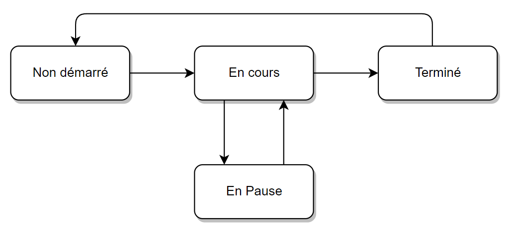
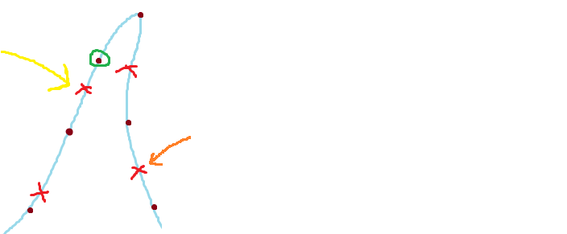

# Suivi excursion

Ce modèle va permettre de gérer tout le suivi de l'utilisateur lorsqu'il lance une excursion.
Il permet :

- La centralisation de toutes les informations necessaires au suivi, de manière independente et globale.
- Le lancement de la tâche de fond qui permet de :
  - Sauvegarder le track reel parcouru
  - Positionner l'utilisateur sur le track suivi (expliqué plus bas)

## Attributs

**etat :** (expliqué plus bas)  
**trackReel :** reel track parcouru par l utilisateur, contenant chacun des points récoltés par la tache de fond  
**trackSuivi :** c'est le track que l utilisateur est censé suivre. Il va plus ou moins diverger mais devrait finir arriver au meme endroit. Ce n'est qu'un repère.  
**iPointCourant :** c'est l'indexe du point dans trackSuivi sur lequel l'utilisateur est positionné. C'est en fait le point de trackSuivi le plus proche de l'utilisateur. Grace à ce pointeur, on a accès aux differentes informations du point courant pointé (distance par rapport à l'origine notament).
**signalements :** liste des signalements presents sur le track suivi. Permet de connaitre un signalement a proximite. La recherche de signalement proche est expliquée plus bas.  
**\_\_DEV\_\_ :** par defaut à faux, permet de mettre un trackSuivi personnalise pour faire des tests manuels

## Etats

En fonction des actions de l'utilisateur, l'état va évoluer. Il ne pourra être modifié qu'en respectant la matrice ci-dessous. Chaque changement va provoquer des traitements sous-jacents tels que la suppression de la tâche de fond, la reinitialisation des données etc...

## Positionnement sur le track suivi

Durant la randonnée, nous avons en permanence besoins de situer l'utilisateur par rapport au track qu'il suit pour avoir les informations liées à ce point et connaitre sa progression sur l'objectif.

Pour ce faire, nous devons à chaque récupération de coordonnées, positionner l utilisateur sur le trackSuivi. L'idée peut sembler simple mais est assez complexe en réalité.

Le but va ainsi être d'expliquer le choix de l'algorithme retenu, qui est une partie centrale de l'application.

### Parcourir chaque points

La première idée, qui est la plus simple à gérer consiste à, pour chaque coordonnées récupérée de l'utilisateur, parcourir chacun des points pour chercher celui qui est le plus proche, et positionner l'utilisateur dessus. L'avantage est surotut la simplicité, et aussi le fait que le point trouvé sera toujours le plus proche, pour sûr. Les inconvénients sont multiples ; ce parcours itératif est très lourd, sur de longues durées et très repetitif (tâche de fond tous les 5m sur plusieurs heures) ET surtout, fait que l utilisateur peut être repositionné sur un point du chemin retour par exemple, qui est proche geographiquement mais qui ne doit arriver que longtemps après, notament sur un track aller retour. Cela le ferait ainsi sauter tous les autres points.

### Se déplacer point par point

L'idée retenue convient mieux, notament parce qu'elle est beaucoup moins couteuse en traitements. Contrairement au parcours de tous les points, il ne regarde que les points voisins et s'arrête de parcourir dès que le point trouvé est le bon. Globalement, il avance ou recule d'un point l'utilisateur
positionne l utilisateur sur le point precedent ou suivant si on est plus proche de ce dernier.

Cette méthode peut poser soucis dans certains cas. L'illustration suivante démontre les limites de cet algorithme.

Légende :

- Tracé bleu : chemin réel de l utilisateur
- Points marrons : points du track suivi, sur lequel l'algo va se positionner l'utilisateur
- Croix rouges : coordonnées récupérées, à la suite desquelles l'algo est effectué.
- Cercle vert : entoure le point courant, sur lequel l'utilisateur est positionné
- Fleches : pour faciliter les explications

Le problème présenté dans cette illustration se produit dans le cas où le track contient une épingle car le point courant se bloque et n'avance plus tant que l'utilisateur est plus proche de lui que du point suivant. Lorsque la position récupérée, pointée par la fleche jaune se produit, l'utilisateur est positionné sur le point entouré en vert. Puisque c'est une épingle, tous les points suivants seront plus proche de lui que du suivant donc le point courant ne va pas avancer et va rester bloqué.

Pour coutourner ce probleme, nous avons mis en place une vérification de securité. Si l'utilisateur est plus loin du point courant que le point suivant, alors on repositionne l'utilisateur en parcourant tous les points pour trouver le plus proche. Sa lourde consommation est négligeable car cela n'arrrive que très rarement, dans le cas d'épingles.

Ainsi, lorsque l'utilisateur commencera à beaucoup s'ecarter (à partir de la fleche orange), il va être repositionné sur le point le plus proche.

## Signalements proches

_A l'heure de la rédaction de cette documentation, cette fonctionnalité est gérée uniquement en front. Elle est vouée à être décalée en back, dans la tâche de fond, pour se produire même téléphone éteint et pour n'avoir qu'une seule tâche de vérification de la localisation._

La tâche de fond est censée, à chaque localisation récupérée, vérifier si l'utilisateur est à moins de 30m d'un signalement. Si c'est le cas, elle va l'en tenir informé par une popup sur l'application. Si la téléphone est en veille, une notification va informer l'utilisateur.

## Chronometrage

_Cette fonctionnalité est également gérée en front à l'heure de la rédaction. Nous ne savons toujours pas de quelle manière nous allons l'implémenter_

Le modèle suiviExcursion va également permettre de gérer le chronometrage de l'application, en tache de fond car, si on le fait en front, elle se met en pause dès qu'on ferme l'appli. Mettre un simple horaire de départ ne peut pas convenir car on peut faire des pauses.

# Contacts

Nicolas DELAHAIE  
<nico601.delahaie@gmail.com>  
+33 7 82 56 37 44

Alexandre PASCAL  
<alexandre.pascal.ep@gmail.com>  
+33 7 83 38 28 68
