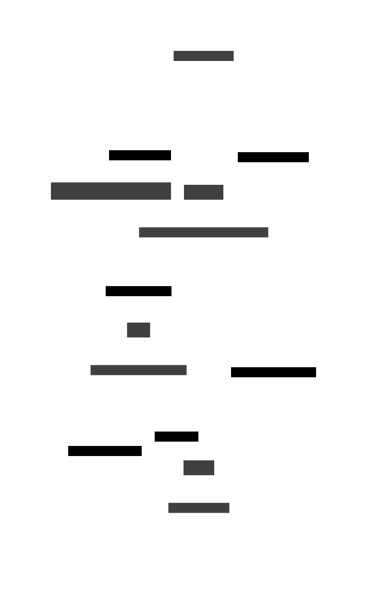

# Fonctionnement de la synchronisation Montante

## Auteur
[Oier Cesat](mailto:oier.cesat@gmail.com)

## Schéma


La synchronisation montante des données fonctionne sur 3 étapes dans l'application Valpineta.

## Fonctionnement

Dans un Screen, l'utilisateur déclenche une action nécessitant l'envoie de données en base de données. Des fonctions sont alors déclenchées afin de vérifier que ce qui est envoyé en base de données soit cohérent et interprétable par le serveur.

###Ajouter un signalement
Pour ajouter un signalement, plusieurs vérification sont faites, et plusieurs demandes de permissions.
Pour pouvoir ajouter une photo, nous avons besoin de la permission de l'utilisateur d'utiliser l'appareil photo ainsi que sa librairie. En fonction de ces autorisations, la fonction choisirPhoto afin un actionSheet, appèle la fonction prendrePhoto() ou bien ajouterPhoto()

Une fois tous les champs ajoutés, la fonction verifSignalement vérifie toutes les informations de l'utilisateur afin de pouvoir envoyer un signalement cohérent à la base de données. S'il un d'eux n'est pas conforme, alors la fonction renvoie à l'utilisateur une alerte informant qu'une des valeurs n'est pas conforme.

### Store
Une fois l'attribut conforme, il est ajouté dans le store synchroMontante. Cela permet de stocker tous les attribut à envoyer et d'y accéder de n'importe où dans l'application. 
Ce strore vient avec plusieurs méthodes qui permettent de gérer la réponse du serveur et d'éffectuer des traitements. Si l'envoie des données ne s'est pas passée correctement, l'attribut est toujours stocké dans le store et sera renvoyé plus tard selon un interval défini par l'utilisateur dans les paramètres. Si l'envoie s'est bien passé, alors l'attribut est supprimé du store afin de ne pas le renvoyer lors du future tentative.

## Tests
Afin de pouvoir tester la synchronisation montante, nous avons réalisés des tests unitaires sur les fonctions permetant de pouvoir envoyer des signalements. Pour l'instant tous les tests réalisés, sont des tests unitaires réalisés avec [Jest](JestGettingStarted) sur la classe et les fonctions du store de la synchronisation montante. Si vous n'êtes pas à l'aise avec les tests, jetez un oeil sur [comment tester Valpineta](documentation-des-tests).

Les fonctions qui sont couvertes par des tests unitaires sont :
```
traiterResultat,
callApi,
tryToPush,
addSignalement,
setIntervalleSynchro,
setTryingtoPush,
```
Nous avons un describe global et 5 sous describe. 
Nous allons décrire plus en détail chaque serie de test.

###Fonctions de manipulation des signalements
Dans cette série, nous testons toutes les fonctions liées à la manipulation des signalements. 

| Nom de la fonction testée | Objectif du test                                                        | Conditions préalables                | Paramètres passés   | Résultat attendu                                                    |
|---------------------------|-------------------------------------------------------------------------|--------------------------------------|---------------------|---------------------------------------------------------------------|
| addSignalement            | Doit ajouter un signalement                                             | synchroMontante doit être initialisé | signalementValide   | La longueur des signalements de synchroMontante doit augmenter de 1 |
| addSignalement            | Doit renvoyer une erreur si on ajoute un signalement vide               | synchroMontante doit être initialisé | {} as T_Signalement | Une erreur doit être renvoyée                                       |
| addSignalement            | Doit renvoyer une erreur si signalement n'est pas de type T_Signalement | synchroMontante doit être initialisé | "test"              | Une erreur doit être renvoyée                                       |

### Fonctions avec l'interval

Dans cette série, nous testons toutes les fonctions liées à la manipulation de l'interval.

| Nom de la fonction testée | Objectif du test                                                                                 | Conditions préalables                | Paramètres passés         | Résultat attendu                                                                                          |
|---------------------------|--------------------------------------------------------------------------------------------------|--------------------------------------|---------------------------|-----------------------------------------------------------------------------------------------------------|
| setIntervalleSynchro      | Doit pouvoir changer l'intervalle de synchronisation                                             | synchroMontante doit être initialisé | IntervalleSynchro.Moderee | L'intervalle de synchronisation de synchroMontante doit être IntervalleSynchro.Moderee                    |
| setIntervalleSynchro      | Doit renvoyer une erreur si on change l'intervalle de synchronisation avec une valeur non valide | synchroMontante doit être initialisé | 0                         | L'intervalle de synchronisation de synchroMontante doit rester inchangé (IntervalleSynchro.TresFrequente) |
| setIntervalleSynchro      | Doit renvoyer une erreur si l'intervalle n'est pas passé en paramètre                            | synchroMontante doit être initialisé | Aucun paramètre           | L'intervalle de synchronisation de synchroMontante doit rester inchangé (IntervalleSynchro.TresFrequente) |

### Fonctions de l'API SynchroMontante

Dans cette série, nous testons la fonction callApi de la classe SynchroMontante.

| Nom de la fonction testée | Objectif du test                                                         | Conditions préalables                | Paramètres passés                                             | Résultat attendu                                           |
|---------------------------|--------------------------------------------------------------------------|--------------------------------------|---------------------------------------------------------------|------------------------------------------------------------|
| callApi                   | Doit renvoyer une réponse valide                                         | synchroMontante doit être initialisé | [signalementValide]                                           | La réponse doit être valide (response.ok doit être vrai)   |
| callApi                   | Doit renvoyer une réponse valide avec un signalement contenant un blob   | synchroMontante doit être initialisé | [signalementAvecBlob]                                         | La réponse doit être valide (response.ok doit être vrai)   |
| callApi                   | Doit renvoyer une réponse valide avec des signalements contenant un blob | synchroMontante doit être initialisé | [signalementAvecBlob, signalementAvecBlob, signalementValide] | La réponse doit être valide (response.ok doit être vrai)   |
| callApi                   | Doit renvoyer faux si il y a un signalement invalide parmi des valides   | synchroMontante doit être initialisé | [signalementValide, signalementInvalide, signalementValide]   | La réponse doit être invalide (response.ok doit être faux) |
| callApi                   | Doit renvoyer faux si callApi n'a aucun paramètre                        | synchroMontante doit être initialisé | Aucun paramètre                                               | La réponse doit être invalide (response.ok doit être faux) |
| callApi                   | Doit renvoyer faux si callApi a un type invalide                         | synchroMontante doit être initialisé | signalementInvalide                                           | La réponse doit être invalide (response.ok doit être faux) |

### Fonctions de traitement des résultats SynchroMontante

Dans cette série, nous testons la fonction traiterResultat de la classe SynchroMontante.

| Nom de la fonction testée | Objectif du test                                                                       | Conditions préalables                                                    | Paramètres passés | Résultat attendu                                                                                             |
|---------------------------|----------------------------------------------------------------------------------------|--------------------------------------------------------------------------|-------------------|--------------------------------------------------------------------------------------------------------------|
| traiterResultat           | Doit renvoyer true si la réponse.ok est true et doit supprimer le signalement          | synchroMontante doit être initialisé avec au moins un signalement valide | { ok: true }      | Le résultat doit être vrai et tous les signalements doivent être supprimés (signalements.length doit être 0) |
| traiterResultat           | Doit renvoyer true si la réponse.ok est true et doit supprimer tous les signalements   | synchroMontante doit être initialisé avec plusieurs signalements valides | { ok: true }      | Le résultat doit être vrai et tous les signalements doivent être supprimés (signalements.length doit être 0) |
| traiterResultat           | Doit renvoyer false si la réponse.ok est false                                         | Aucune condition préalable requise                                       | { ok: false }     | Le résultat doit être faux                                                                                   |
| traiterResultat           | Doit renvoyer faux s'il n'y a pas de réponse                                           | Aucune condition préalable requise                                       | Aucun paramètre   | Le résultat doit être faux                                                                                   |
| traiterResultat           | Doit renvoyer faux si la réponse.ok est false même s'il y a des signalements à envoyer | synchroMontante doit être initialisé avec au moins un signalement valide | { ok: false }     | Le résultat doit être faux                                                                                   |
| traiterResultat           | Doit renvoyer faux s'il n'y a pas de réponse même s'il y a des signalements à envoyer  | synchroMontante doit être initialisé avec au moins un signalement valide | Aucun paramètre   | Le résultat doit être faux                                                                                   |

### Fonctions de tentative d'envoi SynchroMontante

Dans cette série, nous testons la fonction tryToPush de la classe SynchroMontante.

| Nom de la fonction testée | Objectif du test                                                                                                 | Conditions préalables                                                                        | Paramètres passés                                                     | Résultat attendu                                                                                                               |
|---------------------------|------------------------------------------------------------------------------------------------------------------|----------------------------------------------------------------------------------------------|-----------------------------------------------------------------------|--------------------------------------------------------------------------------------------------------------------------------|
| tryToPush                 | Doit renvoyer EtatSynchro.BienEnvoye s'il y a un signalement à envoyer et qu'il y a une connexion                | synchroMontante doit être initialisé avec au moins un signalement valide                     | true, [signalementValide]                                             | Le résultat doit être EtatSynchro.BienEnvoye et tous les signalements doivent être supprimés (signalements.length doit être 0) |
| tryToPush                 | Doit renvoyer EtatSynchro.BienEnvoye s'il y a un signalement avec un blob à envoyer et qu'il y a une connexion   | synchroMontante doit être initialisé avec au moins un signalement valide contenant un blob   | true, [signalementAvecBlob]                                           | Le résultat doit être EtatSynchro.BienEnvoye et tous les signalements doivent être supprimés (signalements.length doit être 0) |
| tryToPush                 | Doit renvoyer EtatSynchro.BienEnvoye s'il y a des signalements avec un blob à envoyer et qu'il y a une connexion | synchroMontante doit être initialisé avec plusieurs signalements valides contenant des blobs | true, [signalementAvecBlob, signalementAvecBlob, signalementAvecBlob] | Le résultat doit être EtatSynchro.BienEnvoye et tous les signalements doivent être supprimés (signalements.length doit être 0) |
| tryToPush                 | Doit renvoyer EtatSynchro.RienAEnvoyer s'il n'y a pas de signalements à envoyer et qu'il y a une connexion       | Aucune condition préalable requise                                                           | true, []                                                              | Le résultat doit être EtatSynchro.RienAEnvoyer et aucun signalement ne doit être supprimé                                      |
| tryToPush                 | Doit renvoyer EtatSynchro.NonConnecte s'il n'y a pas de connexion                                                | Aucune condition préalable requise                                                           | false, [signalementValide]                                            | Le résultat doit être EtatSynchro.NonConnecte                                                                                  |
| tryToPush                 | Doit renvoyer EtatSynchro.NonConnecte s'il y a des signalements à envoyer et qu'il n'y a pas de connexion        | synchroMontante doit être initialisé avec au moins un signalement valide                     | false, [signalementValide]                                            | Le résultat doit être EtatSynchro.NonConnecte et aucun signalement ne doit être supprimé                                       |
| tryToPush                 | Doit renvoyer EtatSynchro.ErreurServeur si les signalements à envoyer ne sont pas bons                           | Aucune condition préalable requise                                                           | true, [signalementInvalide]                                           | Le résultat doit être EtatSynchro.ErreurServeur                                                                                |
| tryToPush                 | Doit renvoyer EtatSynchro.ErreurServeur si un signalement à envoyer n'est pas bon                                | Aucune condition préalable requise                                                           | true, [signalementInvalide, signalementValide, signalementValide]     | Le résultat doit être EtatSynchro.ErreurServeur                                                                                |
| tryToPush                 | Doit renvoyer EtatSynchro.RienAEnvoyer si tryingToPush est vrai                                                  | synchroMontante doit être initialisé avec tryingToPush à true                                | true, [signalementValide]                                             | Le résultat doit être EtatSynchro.RienAEnvoyer                                                                                 |

###Non testé
Les fonctionnalités non testées par les tests unitaire sont ``afterCreate``, ``beforeDestroy``,``startChecking``, car malheureusement, nous avons eut des difficulté a pourvoir créer des mocks afin de pouvoir simuler des fonctions. 
Voici quelques liens afin de pouvoir continuer les recherches :

* [Jest Mocking — Part 3: Timer](jestMockTimer)
* [Lifecycle hooks overview](lifecycleHooksOverview)
* [Timer Mocks](timerMocks)


##Ressources :
* [Jest](JestGettingStarted)
* [Mobx state tree](mobxStateTree)
* [Notre boilerplate avec mobx state tree](notreBoilerplateAvecMobxStateTree)
* [Notre boilerplate avec jest](notreBoilerplateAvecJest)

[JestGettingStarted]: https://jestjs.io/fr/docs/getting-started
[documentation-des-tests]: ./../Test.md

[jestMockTimer]: https://medium.com/trendyol-tech/jest-mocking-part-3-timer-2f2828a70263
[mobxStateTree]: https://mobx-state-tree.js.org/intro/welcome
[lifecycleHooksOverview]: https://mobx-state-tree.js.org/overview/hooks
[timerMocks]: https://jestjs.io/docs/timer-mocks

[notreBoilerplateAvecMobxStateTree]: https://github.com/infinitered/ignite/blob/master/docs/concept/MobX-State-Tree.md
[notreBoilerplateAvecJest]: https://github.com/infinitered/ignite/blob/master/docs/concept/Testing.md
