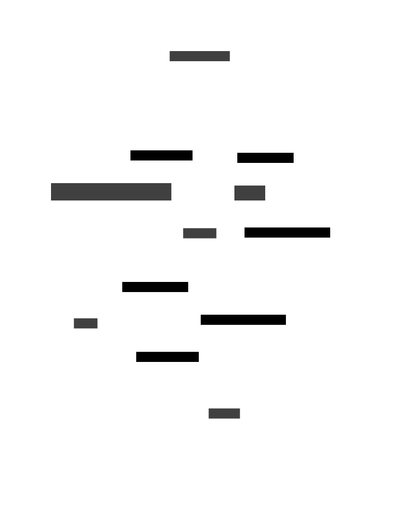

#Fonctionnement de la synchronisation Montante

La synchronisation montante des données fonctionne sur 3 étapes dans l'application Valpineta.

##NouveauSignalementView

Dans cette view, l'utilisateur peut remplir des champs necessaires à l'envoie du signalement comme le titre, la description, et ajouter une image 

Pour pouvoir ajouter une photo, nous avons besoin de la permission de l'utilisateur d'utiliser l'appareil photo ainsi que sa librairie. En fonction de ces autorisations, la fonction choisirPhoto afin un actionSheet, appèle la fonction prendrePhoto() ou bien ajouterPhoto()

Une fois tous les champs ajoutés, la fonction verifSignalement vérifie toutes les informations de l'utilisateur afin de pouvoir envoyer un signalement cohérent à la base de données. S'il un d'eux n'est pas conforme, alors la fonction renvoie à l'utilisateur une alerte informant qu'une des valeurs n'est pas conforme.

##Store
Une fois le signalement crée, il est ajouté dans un store, ici SynchroMontante. Cela permet de stocker dans un tableau tous les signalements à envoyer et d'y accéder de n'importe où dans l'application. 

##Sercive
Le service regroupe toutes les fonctions permetant d'envoyer en base de données un signalement. Dans le fichier synchroMontanteService nous avons plusieurs fonctions atomiques et une englobant tous les autres. Cette fonction globale SynchroMontanteSignalement est appelée par NouveauSignalementScreen lorsque le signalement est validé par vérifSignalement. Ensuite, l'image est transformée en base64, puis on vérifie si le signalement existe déjà dans le store, si ça n'est pas le cas, on l'ajoute dans le store. Ensuite on vérifie si l'application est connecté et dans ce cas le signalement est envoyé en base de données. 
Une fois le signalement envoyé, le serveur renvoie une réponse qui sera traité par le service, puis le service renvera un status à la view, qui affichera une alerte correspondante au status. 
