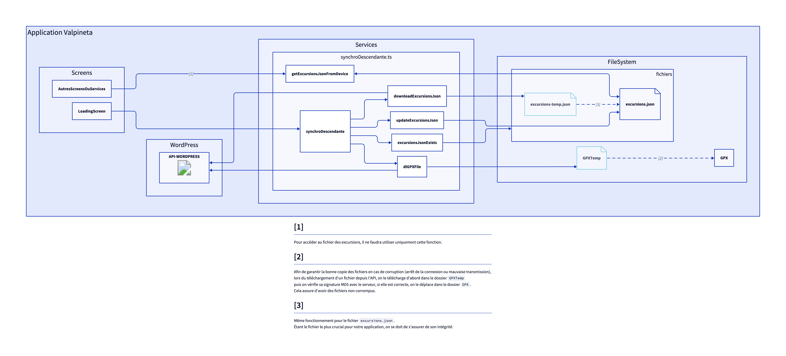

# Schema

Ce service est un service de synchronisation descendante. Il permet de
synchroniser les données de l'API vers les fichiers locaux de l'application.
Cette synchronisation nécessite une connexion internet.

Toutes ses fonctions et son fonctionnement détaillé sont expliqués dans le [script](../synchroDesc.ts).
